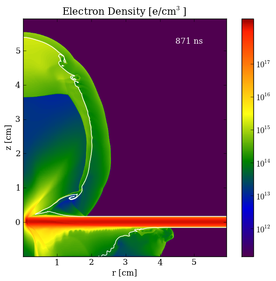
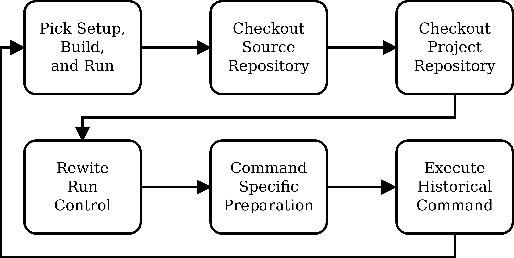

SciPy 2012
==============================

.. container:: main-title

    Total Recall: ``flmake`` and the Quest for Reproducibility

.. container:: main-names

    July 16th, 2012, SciPy, Austin, TX

    Anthony Scopatz 

    The FLASH Center

    The University of Chicago

    scopatz@gmail.com

Introduction
===============================
What is the one thing that we do shamefully poorly as computational scientists?

.. break

.. container:: big-and-center

    *Reproducibility!*

.. break

**Goals:**

.. break

    * Attain a totally reproducible workflow, 

.. break

    * Show that it is not hard (in Python), 

.. break

    * Inspire you!

Soapbox & Terminology
==============================
Much of scientific computing has the trappings of science in that 
it is code produced to solve problems in Science. 

.. break

The process of writing science software is not 
typically itself subject to the scientific method. (HARD!)

.. break

.. container:: align-center

    *The current paradigm is* **periscientific computing,**
    *where developers and scientists may be different people.*

.. break

.. container:: align-center

    *Envision* **diacomputational science,**  *where computation is a substrate
    for all science.*

What is FLASH?
==============================
FLASH code is a modular, parallel multiphysics simulation code for modeling
terrestrial and astrophysical plasmas.  Features include:

.. break

    * Grid: Uniform Grid, AMR

.. break

    * Equation of State: Ideal gas, Multimaterial

.. break

    * Laser ray trace package

.. break

    * Nuclear Burning

What is FLASH?
==============================
.. raw:: pdf

    Spacer 0 30

FLASH Architecture
===============================
FLASH compiles simulation-specific binaries from user defined 
code Units.

.. break

Code Units are mix of Fortran, C, C++, and Python and have  
an OO-esque inheritance model via posix directories.

.. break

To execute a FLASH simulation you must:

.. container:: small

    * setup (pure python), 

.. break

    * build (make),

.. break

    * and run (flash binary).

What is ``flmake``?
===============================
Unlike previous attempts, ``flmake`` is a CLI workflow management tool 
for FLASH simulations whose *express goal* is reproducibility.

.. break

Thus ``flmake`` replaces the existing manual ``setup``, ``build``, 
and ``run`` system.

.. break

The ``flmake reproduce`` command can recreate prior
runs from automatically captured metadata.

.. break

The strategies used here will work wherever the source code must be present for 
the run (ie most Python code).

Source & Project Dirs
====================================
* Without ``flmake``, FLASH must be setup and built from 
  the FLASH source directory. 

.. break

* Sufficient for single runs; fails to separate projects
  and simulation campaigns from the source code. 

.. break

* Makes version control difficult.

.. break

* ``flmake`` has independent source and project directories which are 
  searched for code Units.

Description Sidecar Files
===============================
For each command, a JSON file is written or modified which 
stores the following metadata:

.. break 

.. container:: font-size-24

    * the environment,

.. break 

    * version of project and source repositories,

.. break 

    * local source code modifications (diffs),

.. break 

    * run control files, run ids, and history,

.. break 

    * and FLASH binary modification times.

Description Sidecar Files
===============================
.. raw:: pdf 

    Spacer 0 10

.. code-block:: javascript

    {"setup": {
        "project_diff": "",
        "source_diff": "",
        "timestamp": 1341859081.58047,
        "source_version": [
          "git",
          "bun",
          "3ef5a92d600f0aa1ce26b7174de58089ce6cfa56"],
        "command": ["/home/scopatz/.local/bin/flmake",
          "setup", "-auto", "Sedov"],
        "env": {...}
        }
    }

``flmake reproduce``
===============================
The ``reproduce`` command works by taking description files and 
rerunning ``setup``, ``build``, and ``run``.  It has the following 
limitations:

.. break

    * Project & Source dirs must be version controlled,

.. break

    * The FLASH run must depend on only the runtime
      parameters file, the FLASH executable and datafiles,

.. break

    * and the FLASH executable must not be modified
      between build and run steps.

``flmake reproduce``
===============================
.. raw:: pdf 

    Spacer 0 20

    Reproduce Command Flowchart

Meta-Version Control
===============================
To make reproduce work everywhere, ``flmake`` implements four
version control abstractions:

.. break

    * info

.. break

    * checkout or clone

.. break

    * diff

.. break 

    * patch

.. break 

This is done for git, hg, svn, and release systems.

Command Time Machine
===============================
The reproduce command execute historical versions of the 
key commands as reincarnated by the meta-version control.

.. break

This is akin to the bootstrapping problem.

.. break

This is accomplished though Python namespace
slight-of-hand and relative imports.

.. break

Historical versions of the ``flmake`` source are renamed.  
This dir is then add/del from the front of ``sys.path``.
Modules are then uniquely add/del in ``sys.modules``.

Demo
===============================
.. raw:: pdf 

    Spacer 0 30

A Note on Replication
===============================
A weaker form of reproducibility is known as *replication*.

.. break

.. container:: align-center

    *Replication is the process of recreating a result
    when "you take all the same data and all the same tools" 
    which were used in the original determination.*

.. break

The boundary is fuzzy, but...

.. break

While "the environment" is stored, ``flmake reproduce`` does
not reinstantiate it. 

.. break

Thus this command is a reproducibility tool.

Questions
===============================
.. raw:: pdf 

    Spacer 0 30

.. image:: img/qm.jpg
    :scale: 55%

