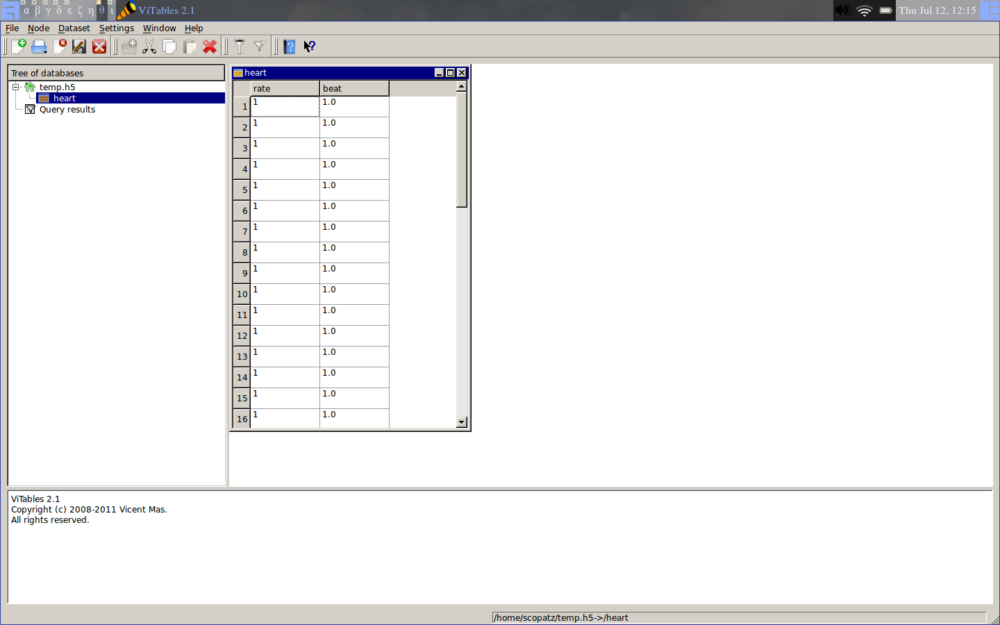

SciPy 2012 - Tutorials
==============================

.. container:: main-title

    HDF5 is for Lovers |nerd_candy_heart|

.. container:: main-names

    July 16th, 2012, SciPy, Austin, TX

    Anthony Scopatz 

    The FLASH Center

    The University of Chicago

    scopatz@gmail.com

.. |nerd_candy_heart| image:: img/nerd_candy_heart.png 
                        :scale: 100%

What is HDF5?
==============================
HDF5 stands for (**H**)eirarchical (**D**)ata (**F**)ormat (**5**)ive.

.. break

It is supported by the lovely people at |hdf_group|

.. break

At its core HDF5 is binary file type specification.

.. break

However, what make HDF5 great is the numerous libraries written to interact 
with files of this type and their *extremely rich* feature set.

.. break

.. raw:: pdf

    Spacer 0 40

.. container:: align-center

    **Which you will learn today!**

A Note on the Format
=================================
Intermixed, there will be:

* Slides
* Interactive Hacking
* Exercises

.. break

Feel free to:

* Ask questions at anytime 
* Explore at your own pace.

A Note on the Format
=================================
This tutorial was submitted to the *Advanced* track.

.. break

And this was slated to be *after* the IPython tutorial.  So...

.. break

.. container:: align-center

    **Get the Program Committee!**

.. image:: img/angry-mob.jpg
    :align: center
    :scale: 250%

.. container:: gray-and-small

    ~please don't!

Class Makeup
==============================
By a show of hands, how many people have used:

* HDF5 before?

.. break

* PyTables?

.. break

* h5py?

.. break

* the HDF5 C API?

.. break

* SQL?

.. break

* Other binary data formats? 

Warm up exercise
===============================
In IPython

.. raw:: pdf

    Spacer 0 20

.. code-block:: python

    import numpy as np
    import tables as tb

    f = tb.openFile('temp.h5', 'a')
    heart = np.ones(42, dtype=[('rate', int), ('beat', float)])
    f.createTable('/', 'heart', heart)
    f.close()

.. raw:: pdf

    Spacer 0 20

Or run ``python exer/warmup.py``

Warm up exercise
===============================
You should see in ViTables:

A Brief Introduction
===========================
For persisting structured numerical data, binary formats are superior
to plaintext.

.. break

For one thing, they are often smaller:

.. code-block:: python

    # small ints       # med ints 
    42   (4 bytes)     123456   (4 bytes)
    '42' (2 bytes)     '123456' (6 bytes)

    # near-int floats  # e-notation floats
    12.34   (8 bytes)  42.424242E+42   (8 bytes)
    '12.34' (5 bytes)  '42.424242E+42' (13 bytes)

A Brief Introduction
===========================
For another, binary formats are often faster for I/O because ``atoi()`` and ``atof()``
are expensive.

.. break

However, you often want some thing more than a binary chunk of data in a file.

.. break

.. note:: This is the mechnaism behind ``numpy.save()`` and ``numpy.savez()``.

A Brief Introduction
===========================
Instead, you want a real *database* with the ability to store many datasets, user-defined
metadata, optimized I/O, and the ability to query its contents.

.. break

Unlike SQL, where every dataset lives in a flat namespace, HDF allows datasets to 
live in a nested tree structure.

.. break

In effect, HDF5 is a file system with a file.  

.. break

(More on this later.)

A Brief Introduction
===========================
Basic dataset classes include:

    * Array
    * CArray (chunked array)
    * EArray (extensible array)
    * Table (structured array w/ named fields)

.. break

All of these must be composed of atomic types.

A Brief Introduction
===========================
There are six kinds of types supported by PyTables:

- bool: Boolean (true/false) types. 8 bits.

.. break

- int: Signed integer types. 8, 16, 32 (default) and 64 bits.

.. break

- uint: Unsigned integers. 8, 16, 32 (default) and 64 bits.

.. break

- float: Floating point types. 16, 32 and 64 (default) bits.

.. break

- complex: Complex number. 64 and 128 (default) bits.

.. break

- string: Raw string types. 8-bit positive multiples.

A Brief Introduction
===========================
Other elements of the heirarchy may include:

    * Groups (dirs)
    * Links
    * File Nodes
    * Hidden Nodes

Acknowlegdements
===============================

Questions
===============================
.. image:: img/qm.jpg
    :scale: 55%

.. raw:: pdf

    Spacer 0 20

.. container:: gray-and-small

    Image source: http://www.fotopedia.com/items/flickr-2200500024

