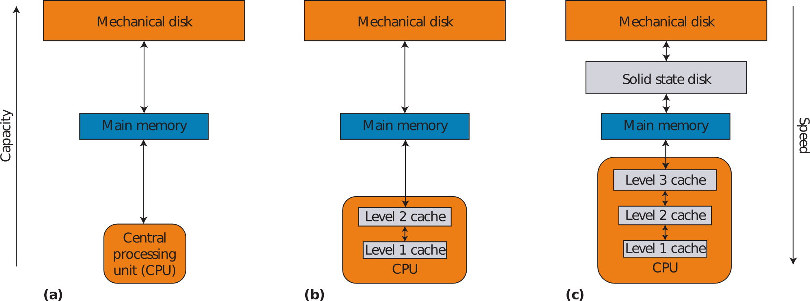
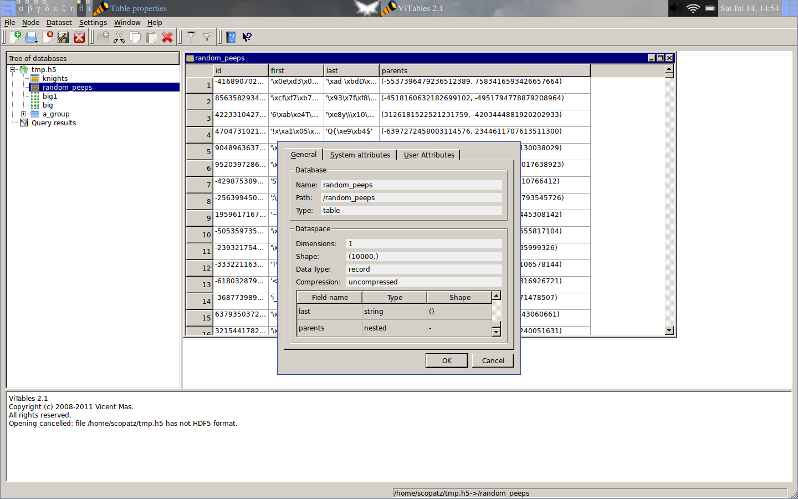
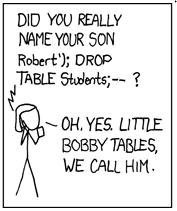

SciPy 2012 - Tutorials
==============================

.. container:: main-title

    HDF 3.11 for Workgroups

.. container:: main-names

    July 16th, 2012, SciPy, Austin, TX

    Anthony Scopatz 

    The FLASH Center

    The University of Chicago

    scopatz@gmail.com

SciPy 2012 - Tutorials
==============================

.. container:: main-title

    HDF5 is for Lovers |nerd_candy_heart|

.. container:: main-names

    July 16th, 2012, SciPy, Austin, TX

    Anthony Scopatz 

    The FLASH Center

    The University of Chicago

    scopatz@gmail.com

.. |nerd_candy_heart| image:: img/nerd_candy_heart.png 
                        :scale: 100%

What is HDF5?
==============================
HDF5 stands for (**H**)eirarchical (**D**)ata (**F**)ormat (**5**)ive.

.. break

It is supported by the lovely people at |hdf_group|

.. break

At its core HDF5 is binary file type specification.

.. break

However, what makes HDF5 great is the numerous libraries written to interact 
with files of this type and their *extremely rich* feature set.

.. break

.. raw:: pdf

    Spacer 0 40

.. container:: align-center

    **Which you will learn today!**

.. |hdf_group| image:: img/hdf_logo.jpg
                :scale: 70%
                :align: middle
                :target: http://www.hdfgroup.org/

A Note on the Format
=================================
Intermixed, there will be:

* Slides
* Interactive Hacking
* Exercises

.. break

Feel free to:

* Ask questions at anytime 
* Explore at your own pace.

A Note on the Format
=================================
This tutorial was submitted to the *Advanced* track.

.. break

And this was slated to be *after* the IPython tutorial.  So...

.. break

.. container:: align-center

    **Get the Program Committee!**

.. image:: img/angry-mob.jpg
    :align: center
    :scale: 250%

.. container:: gray-and-small

    ~please don't!

Class Makeup
==============================
By a show of hands, how many people have used:

* HDF5 before?

.. break

* PyTables?

.. break

* h5py?

.. break

* the HDF5 C API?

.. break

* SQL?

.. break

* Other binary data formats? 

Setup
==============================
.. raw:: pdf

    Spacer 0 30

Please clone the repo:

.. raw:: pdf

    Spacer 0 30

.. code-block:: bash

    git clone git://github.com/scopatz/scipy2012.git

.. raw:: pdf

    Spacer 0 30

Or download a tarball from:

    https://github.com/scopatz/scipy2012

Warm up exercise
===============================
In IPython:

.. raw:: pdf

    Spacer 0 20

.. code-block:: python

    import numpy as np
    import tables as tb

    f = tb.openFile('temp.h5', 'a')
    heart = np.ones(42, dtype=[('rate', int), ('beat', float)])
    f.createTable('/', 'heart', heart)
    f.close()

.. raw:: pdf

    Spacer 0 20

Or run ``python exer/warmup.py``

Warm up exercise
===============================
You should see in ViTables:

.. image:: img/warmup.png
    :align: center
    :scale: 35%

A Brief Introduction
===========================
For persisting structured numerical data, binary formats are superior
to plaintext.

.. break

For one thing, they are often smaller:

.. code-block:: python

    # small ints       # med ints 
    42   (4 bytes)     123456   (4 bytes)
    '42' (2 bytes)     '123456' (6 bytes)

    # near-int floats  # e-notation floats
    12.34   (8 bytes)  42.424242E+42   (8 bytes)
    '12.34' (5 bytes)  '42.424242E+42' (13 bytes)

A Brief Introduction
===========================
For another, binary formats are often faster for I/O because ``atoi()`` and ``atof()``
are expensive.

.. break

However, you often want some thing more than a binary chunk of data in a file.

.. break

.. note:: This is the mechanism behind ``numpy.save()`` and ``numpy.savez()``.

A Brief Introduction
===========================
Instead, you want a real *database* with the ability to store many datasets, user-defined
metadata, optimized I/O, and the ability to query its contents.

.. break

Unlike SQL, where every dataset lives in a flat namespace, HDF allows datasets to 
live in a nested tree structure.

.. break

In effect, HDF5 is a file system within a file.  

.. break

(More on this later.)

A Brief Introduction
===========================
.. container:: font-size-24

    Basic dataset classes include:

        * Array

.. break

        * CArray (chunked array)

.. break

        * EArray (extendable array)

.. break

        * VLArray (variable length array)

.. break

        * Table (structured array w/ named fields)

.. break

.. container:: font-size-24

    All of these must be composed of atomic types.

A Brief Introduction
===========================
There are six kinds of types supported by PyTables:

- bool: Boolean (true/false) types. 8 bits.

.. break

- int: Signed integer types. 8, 16, 32 (default) and 64 bits.

.. break

- uint: Unsigned integers. 8, 16, 32 (default) and 64 bits.

.. break

- float: Floating point types. 16, 32 and 64 (default) bits.

.. break

- complex: Complex number. 64 and 128 (default) bits.

.. break

- string: Raw string types. 8-bit positive multiples.

A Brief Introduction
===========================
Other elements of the hierarchy may include:

    * Groups (dirs)

.. break

    * Links

.. break

    * File Nodes

.. break

    * Hidden Nodes

.. break

PyTables docs may be found at http://pytables.github.com/

Opening Files
=============================
.. code-block:: python

    import tables as tb
    f = tb.openFile('/path/to/file', 'a')

.. break

* *'r'*: Read-only; no data can be modified.
* *'w'*: Write; a new file is created (an existing file with the
  same name would be deleted).
* *'a'*: Append; an existing file is opened for reading and writing,
  and if the file does not exist it is created.
* *'r+'*: It is similar to 'a', but the file must already exist.

Using the Hierarchy
==============================
In HDF5, all nodes stem from a root ("``/``" or ``f.root``).

.. break

In PyTables, you may access nodes as attributes on a Python object
(``f.root.a_group.some_data``).  

.. break

This is known as natural naming.

.. break

Creating new nodes must be done on the file handle:

.. code-block:: python

    f.createGroup('/', 'a_group', "My Group")
    f.root.a_group

Creating Datasets
==============================
The two most common datasets are Tables & Arrays.

.. break

Appropriate create methods live on the file handle:

.. code-block:: python

    # integer array
    f.createArray('/a_group', 'arthur_count', [1, 2, 5, 3])

.. break

.. raw:: pdf

    Spacer 0 20

.. code-block:: python

    # tables, need descriptions
    dt = np.dtype([('id', int), ('name', 'S10')])
    knights = np.array([(42, 'Lancelot'), (12, 'Bedivere')], dtype=dt)
    f.createTable('/', 'knights', dt)
    f.root.knights.append(knights)

Reading Datasets
==============================
Arrays and Tables try to preserve the original flavor that they were created with. 

.. break

.. code-block:: python 

    >>> print f.root.a_group.arthur_count[:]
    [1, 2, 5, 3]

    >>> type(f.root.a_group.arthur_count[:])
    list

    >>> type(f.root.a_group.arthur_count)
    tables.array.Array

Reading Datasets
==============================
So if they come from NumPy arrays, they may be accessed in a numpy-like fashion 
(slicing, fancy indexing, masking).

.. break

.. raw:: pdf

    Spacer 0 15

.. code-block:: python 

    >>> f.root.knights[1]
    (12, 'Bedivere')

    >>> f.root.knights[:1]
    array([(42, 'Lancelot')], dtype=[('id', '<i8'), ('name', 'S10')])

    >>> mask = (f.root.knights.cols.id[:] < 28)
    >>> f.root.knights[mask]
    array([(12, 'Bedivere')], dtype=[('id', '<i8'), ('name', 'S10')])

    >>> f.root.knights[([1, 0],)]
    array([(12, 'Bedivere'), (42, 'Lancelot')], dtype=[('id', '<i8'), ('name', 'S10')])

.. break

.. raw:: pdf

    Spacer 0 15

Data accessed in this way is *memory mapped*.

Exercise
===============================
.. container:: align-center

    **exer/peaks_of_kilimanjaro.py** 

.. raw:: pdf

    Spacer 0 20

Exercise
===============================

.. container:: align-center

    **sol/peaks_of_kilimanjaro.py** 

.. raw:: pdf

    Spacer 0 20

.. image:: img/theblackknighttriumph.jpg
    :scale: 45%

Hierarchy Layout
===============================
Suppose there is a big table of like-things:

.. code-block:: python

    # people:  name,            profession,   home
    people = [('Arthur',        'King',        'Camelot'), 
              ('Lancelot',      'Knight',      'Lake'), 
              ('Bedevere',      'Knight',      'Wales'), 
              ('Witch',         'Witch',       'Village'), 
              ('Guard',         'Man-at-Arms', 'Swamp Castle'),
              ('Ni',            'Knight',      'Shrubbery'),
              ('Strange Woman', 'Lady',        'Lake'),
              ...
              ]

.. break

It is tempting to throw everyone into a big ``people`` table.

Hierarchy Layout
===============================
However, a search over a class of people can be eliminated by splitting 
these tables up:

.. code-block:: python 

    knight = [('Lancelot',      'Knight',      'Lake'),
              ('Bedevere',      'Knight',      'Wales'), 
              ('Ni',            'Knight',      'Shrubbery'),
              ]

    others = [('Arthur',        'King',        'Camelot'), 
              ('Witch',         'Witch',       'Village'), 
              ('Guard',         'Man-at-Arms', 'Swamp Castle'),
              ('Strange Woman', 'Lady',        'Lake'),
              ...
              ]

Hierarchy Layout
===============================
The profession column is now redundant:

.. code-block:: python 

    knight = [('Lancelot', 'Lake'),
              ('Bedevere', 'Wales'), 
              ('Ni',       'Shrubbery'),
              ]

    others = [('Arthur',        'King',        'Camelot'), 
              ('Witch',         'Witch',       'Village'), 
              ('Guard',         'Man-at-Arms', 'Swamp Castle'),
              ('Strange Woman', 'Lady',        'Lake'),
              ...
              ]

Hierarchy Layout
===============================
Information can be embedded implicitly in the hierarchy as well::

    root
      | - England
      |     | - knight
      |     | - others
      |
      | - France
      |     | - knight
      |     | - others

Hierarchy Layout
===============================
Why bother pivoting the data like this at all?

.. break

    * Fewer rows to search over.

.. break

    * Fewer rows to pull from disk.

.. break

    * Fewer columns in description.

.. break

Ultimately, it is all about *speed*, especially for big tables.

Access Time Analogy
==============================
.. container:: small

    If a processor's access of L1 cache is analogous to you finding a 
    word on a computer screen (3 seconds), then

.. break

    Accessing L2 cache is getting a book from a bookshelf (15 s).

.. break

    Accessing main memory is going to the break room, get a candy bar, 
    and chatting with your co-worker (4 min).

.. break

    Accessing a (mechanical) HDD is leaving your office, leaving your building, 
    wandering the planet for a year and four months to return to your desk with 
    the information finally made available.

.. container:: gray-and-small

    Thanks K. Smith & 
    http://duartes.org/gustavo/blog/post/what-your-computer-does-while-you-wait

Starving CPU Problem
===============================
Waiting around for access times prior to computation is known as the 
*Starving CPU Problem*.

.. raw:: pdf

    Spacer 0 20

.. raw:: pdf

    Spacer 0 20

.. container:: gray-and-small

    Francesc Alted. 2010. Why Modern CPUs Are Starving and What Can 
    Be Done about It. IEEE Des. Test 12, 2 (March 2010), 68-71. 
    DOI=10.1109/MCSE.2010.51 http://dx.doi.org/10.1109/MCSE.2010.51

Tables
===============================
Tables are a high-level interface to extendable arrays of structs.  

.. break

Sort-of.

.. break

In fact, the struct / dtype / description concept is only a convenient way to assign 
meaning to bytes::

    |  ids  |       first       |        last       |
    |-------|-------------------|-------------------|
    | | | | | | | | | | | | | | | | | | | | | | | | | 

Tables
===============================
Data types may be nested (though they are stored in flattened way).

.. code-block:: python

    dt = np.dtype([('id', int), 
                   ('first', 'S5'),
                   ('last',  'S5'),
                   ('parents', [
                        ('mom_id', int),
                        ('dad_id', int),
                    ]),
                  ])

    people = np.fromstring(np.random.bytes(dt.itemsize * 10000), dt)
    f.createTable('/', 'random_peeps', people)

Tables
===============================

Tables
===============================
Python already has the ability to dynamically declare the size of 
descriptions.  

.. break

This is accomplished in compiled languages through normal memory allocation 
and careful byte counting:

.. code-block:: C

    typedef struct mat {
      double mass;
      int atoms_per_mol;
      double comp [];
    } mat;

Tables
===============================
.. code-block:: C

    typedef struct mat {
      double mass;
      int atoms_per_mol;
      double comp [];
    } mat;

    size_t mat_size = sizeof(mat) + sizeof(double)*comp_size;
    hid_t desc = H5Tcreate(H5T_COMPOUND, mat_size);
    hid_t comptype = H5Tarray_create2(H5T_NATIVE_DOUBLE, 1, nuc_dims);

    // make the data table type
    H5Tinsert(desc, "mass", HOFFSET(mat, mass), H5T_NATIVE_DOUBLE);
    H5Tinsert(desc, "atoms_per_mol", HOFFSET(mat, atoms_per_mol), H5T_NATIVE_DOUBLE);
    H5Tinsert(desc, "comp", HOFFSET(mat, comp), comp_type);

    // make the data array for a single row, have to over-allocate
    mat * mat_data  = new mat[mat_size];

    // ...fill in data array...

    // Write the row
    H5Dwrite(data_set, desc, mem_space, data_hyperslab, H5P_DEFAULT, mat_data);

Exercise
===============================
.. container:: align-center

    **exer/boatload.py** 

.. raw:: pdf

    Spacer 0 20

Exercise
===============================

.. container:: align-center

    **sol/boatload.py** 

.. raw:: pdf

    Spacer 0 20

.. image:: img/theblackknighttriumph.jpg
    :scale: 45%

Chunking
===============================
Chunking is a feature with no direct analogy in NumPy.

.. break

.. container:: align-center

    *Chunking is the ability to split up a dataset into smaller 
    blocks of equal or lesser rank.*

.. break

Extra metadata pointing to the location of the chunk in the 
file and in dataspace must be stored.

.. break

By chunking, sparse data may be stored efficiently and 
datasets may extend infinitely in all dimensions.

.. break

.. container:: small

    **Note:** Currently, PyTables only allows one extendable dim.

Chunking
===============================
.. raw:: pdf

    Spacer 0 20

.. figure:: img/dset_contiguous.jpg

    Contiguous Dataset

.. raw:: pdf

    Spacer 0 50

.. figure:: img/dset_chunked.jpg

    Chunked Dataset

Chunking
===============================
All I/O happens by chunk.  This is important for:

    * edge chunks may extend beyond the dataset

.. break

    * default fill values are set in unallocated space

.. break

    * reading and writing in parallel

.. break

    * small chunks are good for accessing some of data

.. break

    * large chunks are good for accessing lots of data

Chunking
===============================
Any chunked dataset allows you to set the chunksize.

.. code-block:: python

    f.createTable('/', 'omnomnom', data, chunkshape=(42,42))

.. break

For example, a 4x4 chunked array could have a 3x3 chunksize.

.. break

However, it could not have a 12x12 chunksize, since the ranks must be 
less than or equal to that of the array.

.. break

Manipulating the chunksize is a great way to fine-tune an application.

Chunking
===============================
.. figure:: img/dset_contiguous4x4.jpg

    Contiguous 4x4 Dataset

.. raw:: pdf

    Spacer 0 20

.. figure:: img/dset_chunked4x4.jpg

    Chunked 4x4 Dataset

Chunking
===============================
Note that the addresses of chunks in dataspace (memory) has 
no bearing on their arrangement in the actual file.

.. raw:: pdf

    Spacer 0 40

.. figure:: img/dset_address_space.jpg

    Dataspace (top) vs File (bottom) Chunk Locations

In-Core vs Out-of-Core
===============================
Calculations depend on the current memory layout.

.. break

Recall access time analogy (wander Earth for 16 months).

.. break

**Definitions:**

.. break

    * Operations which require all data to be in memory are *in-core* and 
      may be memory bound (NumPy).

.. break

    * Operations where the dataset is external to memory are *out-of-core*
      (or *in-kernel*) and may be CPU bound.

In-Core Operations
==============================
Say, ``a`` and ``b`` are arrays sitting in memory:

.. raw:: pdf

    Spacer 0 10

.. code-block:: python

    a = np.array(...)
    b = np.array(...)
    c = 42 * a + 28 * b + 6

.. break

.. raw:: pdf

    Spacer 0 10

The expression for ``c`` creates three temporary arrays!

.. break

For ``N`` operations, ``N-1`` temporaries are made.

.. break

Wastes memory and is slow.  Pulling from disk is slower.

In-Core Operations
==============================
A less memory intensive implementation would be an element-wise
evaluation:

.. raw:: pdf

    Spacer 0 10

.. code-block:: python

    c = np.empty(...)
    for i in range(len(c)):
        c[i] = 42 * a[i] + 28 * b[i] + 6

.. break

.. raw:: pdf

    Spacer 0 10

.. container:: font-size-24

    But if ``a`` and ``b`` were HDF5 arrays on disk, individual 
    element access time would kill you.  

.. break

    Even with in memory NumPy arrays, there are problems with 
    gratuitous Python type checking. 

Out-of-Core Operations
===============================
.. container:: font-size-24

    Say there was a virtual machine (or kernel) which could be 
    fed arrays and perform specified operations.

.. break

    Giving this machine only chunks of data at a time, it 
    could function on infinite-length data using only finite 
    memory.

.. break

.. code-block:: python

    for i in range(0, len(a), 256):
        r0, r1 = a[i:i+256], b[i:i+256]
        multiply(r0, 42, r2)
        multiply(r1, 28, r3)
        add(r2, r3, r2); add(r2,  6, r2)
        c[i:i+256] = r2

Out-of-Core Operations
===============================
This is the basic idea behind numexpr, which provides a general 
virtual machine for NumPy arrays.

.. break

This problem lends itself nicely to parallelism.  

.. break

Numexpr has low-level multithreading, avoiding the GIL.

.. break

PyTables implements a ``tb.Expr`` class which backends to the numexpr VM
but has additional optimizations for disk reading and writing.

.. break

The full array need never be in memory.

Out-of-Core Operations
===============================
Fully out-of-core expression example:

.. raw:: pdf

    Spacer 0 10

.. code-block:: python

    shape = (10, 10000)
    f = tb.openFile("/tmp/expression.h5", "w")

    a = f.createCArray(f.root, 'a', tb.Float32Atom(dflt=1.), shape)
    b = f.createCArray(f.root, 'b', tb.Float32Atom(dflt=2.), shape)
    c = f.createCArray(f.root, 'c', tb.Float32Atom(dflt=3.), shape)
    out = f.createCArray(f.root, 'out', tb.Float32Atom(dflt=3.), shape)

    expr = tb.Expr("a*b+c")
    expr.setOutput(out)
    d = expr.eval()

    print "returned-->", repr(d)
    f.close()

Querying
===============================
The most common operation is asking an existing dataset
whether its elements satisfy some criteria.  
This is known as *querying*.  

.. break

Because querying is so common PyTables defines special methods on 
Tables.

.. break

.. code-block:: python

    tb.Table.where(cond)
    tb.Table.getWhereList(cond)
    tb.Table.readWhere(cond)
    tb.Table.whereAppend(dest, cond)

Querying
===============================
The conditions used in ``where()`` calls are strings which are 
evaluated by numexpr.  These expressions must return boolean
values.

.. break

They are executed in the context of table itself combined with 
``locals()`` and ``globals()``.

.. break

The ``where()`` method itself returns an iterator over all 
matched (hit) rows:

.. code-block:: python

    for row in table.where('(col1 < 42) & (col2 == col3)'):
        # do something with row

Querying
===============================
For a speed comparison, here is a complex query using 
regular Python:

.. code-block:: python

    result = [row['col2'] for row in table if (
              ((row['col4'] >= lim1 and row['col4'] < lim2) or
              ((row['col2'] > lim3 and row['col2'] < lim4])) and
              ((row['col1']+3.1*row['col2']+row['col3']*row['col4']) > lim5)
              )]

.. break

And this is the equivalent out-of-core search:

.. code-block:: python

    result = [row['col2'] for row in table.where(
                '(((col4 >= lim1) & (col4 < lim2)) | '
                '((col2 > lim3) & (col2 < lim4)) &   '
                '((col1+3.1*col2+col3*col4) > lim5)) ')]

Querying
===============================
.. figure:: img/where_compare_10Mrow.png
    :scale: 77%

    Complex query with 10 million rows. Data fits in memory.

Querying
===============================
.. figure:: img/where_compare_1Grow.png
    :scale: 77%

    Complex query with 1 billion rows. Too big for memory.

Exercise
===============================
.. container:: align-center

    **exer/crono.py** 

.. raw:: pdf

    Spacer 0 20

Exercise
===============================

.. container:: align-center

    **sol/crono.py** 

.. raw:: pdf

    Spacer 0 20

.. image:: img/theblackknighttriumph.jpg
    :scale: 45%

Compression
===============================
A more general way to solve the starving CPU problem is through
*compression*.

.. break

Compression is when the dataset is piped through a zipping algorithm
on write and the inverse unzipping algorithm on read.

.. break 

Each chunk is compressed independently, so chunks end up with a
varying number bytes.

.. break

Has some storage overhead, but may drastically reduce file sizes for 
very regular data.

Compression
===============================
At first glance this is counter-intuitive. (*Why?*)

.. break

Compression/Decompression is clearly more CPU
intensive than simply blitting an array into memory.

.. break

However, because there is *less total information* to transfer, 
the time spent unpacking the array can be far less than moving 
the array around wholesale.

.. break

This is kind of like power steering, you can either tell wheels
how to turn manually or you can tell the car how you want the wheels
turned.

Compression
===============================
Compression is a guaranteed feature of HDF5 itself.

.. break

At minimum, HDF5 requires zlib.

.. break

The compression capabilities feature a plugin architecture which 
allow for a variety of different algorithms, including user defined ones!

.. break

PyTables supports:

.. container:: align-center

    |bullet| zlib (default), |bullet| lzo, |bullet| bzip2, and |bullet| blosc.

.. |bullet| unicode:: U+2022 

Compression
===============================
Compression is enabled in PyTables through *filters*.

.. break 

.. raw:: pdf

    Spacer 0 5

.. code-block:: python

    # complevel goes from [0,9]
    filters = tb.Filters(complevel=5, complib='blosc', ...)

.. break 

    # filters may be set on the whole file,
    f = tb.openFile('/path/to/file', 'a', filters=filters)
    f.filters = filters

.. break 

    # filters may also be set on most other nodes
    f.createTable('/', 'table', desc, filters=filters)
    f.root.group._v_filters = filters

.. break 

.. raw:: pdf

    Spacer 0 5

Filters only act on chunked datasets.

Compression
===============================
Tips for choosing compression parameters:

.. break

    * A mid-level (5) compression is sufficient. No need to go all the
      way up (9).

.. break

    * Use zlib if you must guarantee complete portability.

.. break

    * Use blosc all other times.  It is optimized for HDF5.

.. break

*But why?* (I don't have time to go into the details of blosc. However
here are some justifications...)

Compression
===============================
.. figure:: img/compressed-recordsize-zlib.png

    Comparison of different compression levels of zlib.

Compression
===============================
.. figure:: img/create-chunksize-15GB.png
    :scale: 70%

    Creation time per element for a 15 GB EArray and different chunksizes.

Compression
===============================
.. figure:: img/filesizes-chunksize-15GB.png
    :scale: 80%

    File sizes for a 15 GB EArray and different chunksizes.

Compression
===============================
.. figure:: img/seq-chunksize-15GB.png
    :scale: 70%

    Sequential access time per element for a 15 GB EArray and different chunksizes.

Compression
===============================
.. figure:: img/random-chunksize-15GB.png
    :scale: 70%

    Random access time per element for a 15 GB EArray and different chunksizes.

Exercise
===============================
.. container:: align-center

    **exer/spam_filter.py** 

.. raw:: pdf

    Spacer 0 20

Exercise
===============================

.. container:: align-center

    **sol/spam_filter.py** 

.. raw:: pdf

    Spacer 0 20

.. image:: img/theblackknighttriumph.jpg
    :scale: 45%

Other Python Data Structures
===============================
Overwhelmingly, numpy arrays have been the in-memory data
structure of choice.

.. break

Using lists or tuples instead of arrays follows analogously.

.. break

It is data structures like sets and dictionaries which do not
quite map.  

.. break

However, as long as all elements may be cast into the same atomic type, 
these structures can be stored in HDF5 with relative ease.

Sets
===============================
Example of serializing and deserializing sets:

.. code-block:: python

    >>> s = {1.0, 42, 77.7, 6E+01, True}

    >>> f.createArray('/', 's', [float(x) for x in s])
    /s (Array(4,)) ''
      atom := Float64Atom(shape=(), dflt=0.0)
      maindim := 0
      flavor := 'python'
      byteorder := 'little'
      chunkshape := None

    >>> set(f.root.s)
    set([1.0, 42.0, 77.7, 60.0])

Exercise
===============================
.. container:: align-center

    **exer/dict_table.py** 

.. raw:: pdf

    Spacer 0 20

Exercise
===============================

.. container:: align-center

    **sol/dict_table.py** 

.. raw:: pdf

    Spacer 0 20

.. image:: img/theblackknighttriumph.jpg
    :scale: 45%

What Was Missed
==============================
* Walking Nodes
* File Nodes
* Indexing
* Migrating to / from SQL
* HDF5 in other database formats
* Other Databases in HDF5
* HDF5 as a File System

Acknowledgements
===============================
Many thanks to everyone who made this possible!

.. break

    * The HDF Group 

.. break

    * The PyTables Governance Team:

.. container:: align-center

    |bullet| Josh Moore, |bullet| Antonio Valentino, |bullet| Josh Ayers 

Acknowledgements
===============================
(Cont.) 

    * The NumPy Developers

.. break

    * h5py, the symbiotic project

.. break

    * Francesc Alted |nerd_candy_heart|

.. break

.. container:: align-center

    **Shameless Plug:** *We are always looking for more hands. Join Now!*

Questions
===============================
.. raw:: pdf

    Spacer 0 50

